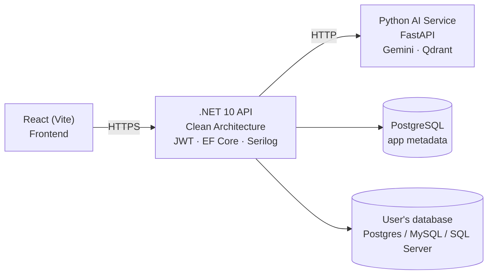

# SqlSpace

> Natural-language analytics for small business owners — ask questions in plain English, get SQL-backed answers, charts, and auto-generated reports.

[](https://dotnet.microsoft.com/)
[](https://react.dev/)
[](https://www.typescriptlang.org/)
[](#license)

> **Status:** under active development. Expect breaking changes as the codebase evolves.

---


## The problem

Small business owners and entrepreneurs sit on operational data in SQL databases but can't write SQL. SqlSpace lets them type plain-English questions and get back answers, charts, and full multi-section reports. It connects to their existing **PostgreSQL, MySQL, or SQL Server** database — no migration required.

---

## What's built today

**Querying**

- Natural-language → SQL execution against the user's connected database
- Query history with search, pagination, and per-connection filtering
- Saved queries for reuse
- Multi-database support: PostgreSQL, MySQL, SQL Server

**Visualization**

- AI-suggested charts based on database schema analysis
- Drag-to-arrange dashboard with persistent grid layouts
- Chart types: line, bar, pie, treemap (Chart.js + Recharts)
- Refresh, update, and delete individual charts

**Reports**

- Auto-generated multi-section reports from a single prompt
- Stored as structured sections (SQL + narrative); refresh re-executes the SQL

**Knowledge base (RAG)**

- Upload PDF / DOCX / TXT documents
- Chat-style Q&A grounded in uploaded documents, with persisted chat history

**Auth & access control**

- JWT authentication with refresh tokens (ASP.NET Core Identity)
- Per-connection RBAC — users own connections and grant access to others
- Full audit log of every query and connection access

---

## Architecture



The React frontend talks only to the .NET API. The API persists app metadata (users, connections, saved queries, reports, audit logs) in its own PostgreSQL database, and connects to the **user's** business database to execute their queries. For natural-language tasks it calls a separate Python AI microservice over HTTP (see [`AI-based_DSS/`](AI-based_DSS/)), which uses Google Gemini and Qdrant for text-to-SQL, RAG, and report generation.

---

## Tech stack

| Layer | Tech |
| --- | --- |
| **Backend** | .NET 10, ASP.NET Core, EF Core 10, ASP.NET Identity, JWT, Serilog, Scalar / Swagger, xUnit |
| **Database drivers** | Npgsql (PostgreSQL), MySqlConnector (MySQL), Microsoft.Data.SqlClient (SQL Server) |
| **Frontend** | React 19, TypeScript, Vite 8, TanStack Query + Table, Zustand, React Router 7, Tailwind 4, Chart.js + Recharts, Monaco Editor, react-grid-layout, React-Hook-Form + Zod, Axios |
| **External AI service** | FastAPI, Google Gemini 2.5 Flash, Qdrant, LangChain |

---

## Repo structure

```text
SqlSpace/
├── src/
│   ├── SqlSpace.Api/             # Controllers, Program.cs
│   ├── SqlSpace.Application/     # Services, abstractions
│   ├── SqlSpace.Domain/          # Entities, domain logic
│   └── SqlSpace.Infrastructure/  # EF Core, AI HTTP clients
├── tests/
│   └── SqlSpace.Application.Tests/
├── FrontEnd/sqlspace-frontend/   # React frontend
└── AI-based_DSS/                 # Python AI service (separate component)
```

---

## Run it locally

**Prerequisites**: .NET 10 SDK, Node.js 20+, PostgreSQL 14+, the AI service running on `http://localhost:8000` (see [`AI-based_DSS/README.md`](AI-based_DSS/README.md)).

**Backend**

```bash
cd src/SqlSpace.Api
dotnet user-secrets init
dotnet user-secrets set "ConnectionStrings:DefaultConnection" "Host=localhost;Port=5432;Database=SqlSpace;Username=postgres;Password=YOUR_PASSWORD"
dotnet user-secrets set "JwtSettings:Secret" "YOUR_JWT_SECRET"
dotnet ef database update --project ../SqlSpace.Infrastructure --startup-project .
dotnet run
```

API docs are available at `/scalar/v1` (Scalar) and `/swagger` (Swagger UI) in Development.

**Frontend**

```bash
cd FrontEnd/sqlspace-frontend
npm install
npm run dev
```

Frontend runs at `http://localhost:5173` — already whitelisted in the API's CORS config.

---

## Configuration

The API reads `src/SqlSpace.Api/appsettings.json`. Key sections:

| Key | Purpose |
| --- | --- |
| `ConnectionStrings:DefaultConnection` | PostgreSQL connection for app metadata |
| `JwtSettings` | `Audience`, `Issuer`, `Secret`, `TokenExpirationInMinutes` |
| `LlmApi` | Text-to-SQL endpoint: `BaseLink`, `ApiKey`, `TimeoutSeconds` |
| `RagApi` | Knowledge-base endpoint: `BaseUrl`, `InternalApiKey`, `TimeoutSeconds`, `MaxUploadSizeMb`, `DefaultTopK`, `AllowedExtensions` |
| `Serilog` | Console + rolling-file log sinks |

---
